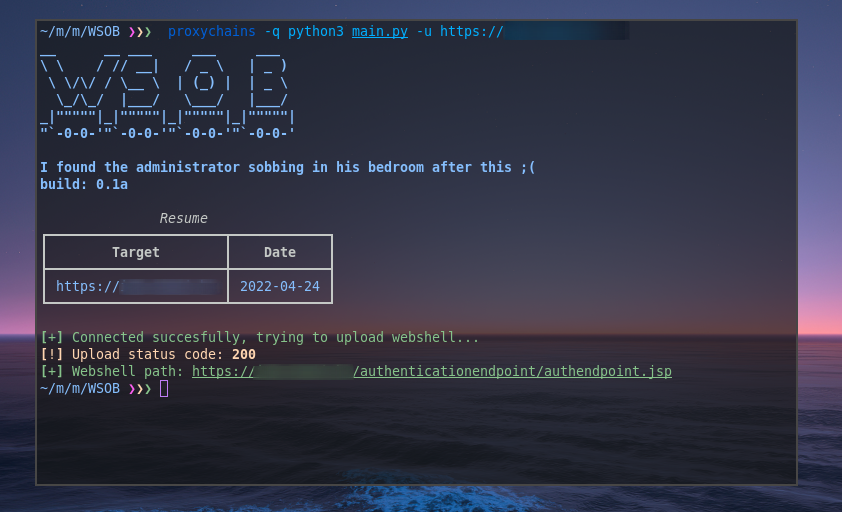

# 😭 WSOB (CVE-2022-29464)

<div align="center">
    
</div>

<br>

<p align="center">
    
    
    
    
</p>

**😭 WSOB** is a python created to exploit the new vulnerability on WSO2 assigned as CVE-2022-29464.

<br>

## CVE-2022-29464 details:
Certain WSO2 products allow unrestricted file upload with resultant remote code execution. The attacker must use a /fileupload endpoint with a Content-Disposition directory traversal sequence to reach a directory under the web root, such as a ../../../../repository/deployment/server/webapps directory. This affects WSO2 API Manager 2.2.0 and above through 4.0.0; WSO2 Identity Server 5.2.0 and above through 5.11.0; WSO2 Identity Server Analytics 5.4.0, 5.4.1, 5.5.0, and 5.6.0; WSO2 Identity Server as Key Manager 5.3.0 and above through 5.10.0; and WSO2 Enterprise Integrator 6.2.0 and above through 6.6.0.

Source: https://nvd.nist.gov/vuln/detail/CVE-2022-29464

<br><br>

## ⚡ Installing / Getting started

<p> A quick guide of how to install and use WSOB. </p>

```
1. Clone the repository - git clone https://github.com/oppsec/wsob.git
2. Install the libraries - pip3 install -r requirements.txt
3. Run WSOB2 - python3 main.py -u https://example.com
```

<br><br>

## ⚙️ Pre-requisites
- [Python 3](https://www.python.org/downloads/) installed on your machine.
- Install the libraries with `pip3 install -r requirements.txt`

<br><br>

## 🔨 Contributing

A quick guide of how to contribute with the project.

```
1. Create a fork from WSOB repository
2. Download the project with git clone https://github.com/your/wsob.git
3. Make your changes
4. Commit and make a git push
5. Open a pull request
```

<br><br>

## 🙏 Credits
- Credits to hakivvi for the original exploit

<br><br>

## ⚠️ Warning
- The developer is not responsible for any malicious use of this tool.